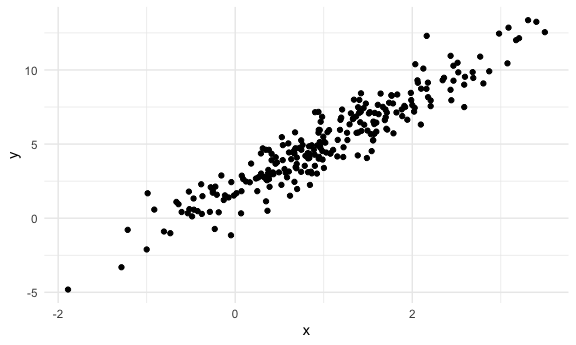
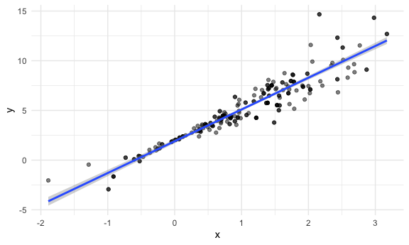

bootstraping
================
Longyi Zhao
2023-11-16

``` r
library(tidyverse)
```

    ## ── Attaching core tidyverse packages ──────────────────────── tidyverse 2.0.0 ──
    ## ✔ dplyr     1.1.3     ✔ readr     2.1.4
    ## ✔ forcats   1.0.0     ✔ stringr   1.5.0
    ## ✔ ggplot2   3.4.3     ✔ tibble    3.2.1
    ## ✔ lubridate 1.9.2     ✔ tidyr     1.3.0
    ## ✔ purrr     1.0.2     
    ## ── Conflicts ────────────────────────────────────────── tidyverse_conflicts() ──
    ## ✖ dplyr::filter() masks stats::filter()
    ## ✖ dplyr::lag()    masks stats::lag()
    ## ℹ Use the conflicted package (<http://conflicted.r-lib.org/>) to force all conflicts to become errors

``` r
library(modelr)
library(p8105.datasets)

knitr::opts_chunk$set(
  fig.width = 6,
  fig.asp = .6, 
  out.width = "90%"
)

theme_set (theme_minimal() +theme(legend.position = "bottom"))

options(
  ggplot2.continuous.colour = "viridis", 
  ggplots.continuous.fill = "viridis"
)

scale_colour_discrete = scale_colour_viridis_d
scale_fill_disrete = scale_fill_viridis_d

set.seed(1)
```

## generate a relevant example

``` r
n_samp = 250

sim_df_const = 
  tibble(
    x = rnorm(n_samp, 1, 1),
    error = rnorm(n_samp, 0, 1),
    y = 2 + 3 * x + error
  )

sim_df_nonconst = sim_df_const |> 
  mutate(
  error = error * .75 * x,
  y = 2 + 3 * x + error
)

sim_df_const |>
  ggplot(aes(x = x, y = y)) + geom_point()
```



fit some linear models

``` r
sim_df_const|>
  lm(y~x, data = _) |>
  broom::tidy()
```

    ## # A tibble: 2 × 5
    ##   term        estimate std.error statistic   p.value
    ##   <chr>          <dbl>     <dbl>     <dbl>     <dbl>
    ## 1 (Intercept)     1.98    0.0981      20.2 3.65e- 54
    ## 2 x               3.04    0.0699      43.5 3.84e-118

``` r
sim_df_nonconst|>
  lm(y~x, data=_) |>
  broom::tidy()
```

    ## # A tibble: 2 × 5
    ##   term        estimate std.error statistic   p.value
    ##   <chr>          <dbl>     <dbl>     <dbl>     <dbl>
    ## 1 (Intercept)     1.93    0.105       18.5 1.88e- 48
    ## 2 x               3.11    0.0747      41.7 5.76e-114

``` r
# data is not supposed to look at that, still want to extract informaiton from it?
```

## Draw and analyze a bootstrap sample

start with a little function

``` r
boot_sample = function(df) {
  sample_frac(df, replace = TRUE)
}
```

Lets see how this works

``` r
sim_df_nonconst |> 
  boot_sample() |>
  ggplot(aes(x = x, y = y)) + 
  geom_point(alpha = .5) +
  stat_smooth(method = "lm")
```

    ## `geom_smooth()` using formula = 'y ~ x'



``` r
# different degree of shading for points, picking the same thing several times, get darker points. 
```

## Draw a lot of samples and analyze them

``` r
boot_straps = 
  tibble(strap_number = 1:100) |> 
  mutate(
    strap_sample = map(strap_number, \(i) boot_sample(df = sim_df_nonconst))
  )

boot_straps |>
  pull(strap_sample) |>
  nth(2) |>
  arrange(x)
```

    ## # A tibble: 250 × 3
    ##         x  error       y
    ##     <dbl>  <dbl>   <dbl>
    ##  1 -1.29   1.40  -0.454 
    ##  2 -0.989 -1.97  -2.93  
    ##  3 -0.914 -0.908 -1.65  
    ##  4 -0.914 -0.908 -1.65  
    ##  5 -0.805  0.292 -0.123 
    ##  6 -0.805  0.292 -0.123 
    ##  7 -0.665 -0.544 -0.539 
    ##  8 -0.641 -0.416 -0.338 
    ##  9 -0.606 -0.106  0.0774
    ## 10 -0.606 -0.106  0.0774
    ## # ℹ 240 more rows

now do the lm fit

``` r
boot_results =
  boot_straps|>
  mutate(models = map(strap_sample, \(df) lm(y~x, data = df)), 
         results = map(models, broom::tidy)
  ) |>
  select(strap_number, results) |>
  unnest(results)


# fit a correspond linear model to all of these
```
