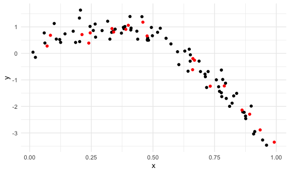
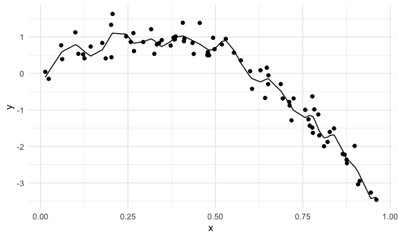

cross validation
================
Longyi Zhao
2023-11-14

``` r
library(tidyverse)
```

    ## ── Attaching core tidyverse packages ──────────────────────── tidyverse 2.0.0 ──
    ## ✔ dplyr     1.1.3     ✔ readr     2.1.4
    ## ✔ forcats   1.0.0     ✔ stringr   1.5.0
    ## ✔ ggplot2   3.4.3     ✔ tibble    3.2.1
    ## ✔ lubridate 1.9.2     ✔ tidyr     1.3.0
    ## ✔ purrr     1.0.2     
    ## ── Conflicts ────────────────────────────────────────── tidyverse_conflicts() ──
    ## ✖ dplyr::filter() masks stats::filter()
    ## ✖ dplyr::lag()    masks stats::lag()
    ## ℹ Use the conflicted package (<http://conflicted.r-lib.org/>) to force all conflicts to become errors

``` r
library(modelr)
library(mgcv)
```

    ## Loading required package: nlme
    ## 
    ## Attaching package: 'nlme'
    ## 
    ## The following object is masked from 'package:dplyr':
    ## 
    ##     collapse
    ## 
    ## This is mgcv 1.9-0. For overview type 'help("mgcv-package")'.

``` r
knitr::opts_chunk$set(
  fig.width = 6,
  fig.asp = .6, 
  out.width = "90%"
)

theme_set (theme_minimal() +theme(legend.position = "bottom"))

options(
  ggplot2.continuous.colour = "viridis", 
  ggplots.continuous.fill = "viridis"
)

scale_colour_discrete = scale_colour_viridis_d
scale_fill_disrete = scale_fill_viridis_d

set.seed(1)
```

## nonlinear data and CV

``` r
# generate data under a non-linear model 
nonlin_df = 
  tibble(
    id = 1:100,
    x = runif(100, 0, 1),
    y = 1 - 10 * (x - .3) ^ 2 + rnorm(100, 0, .3)
  )

nonlin_df |> 
  ggplot(aes(x = x, y = y)) + 
  geom_point()
```


build several models to see which one works the best

``` r
train_df = sample_n(nonlin_df, 80)
test_df = anti_join(nonlin_df, train_df, by = "id") #return what in the nonlin_df but not in the train_df

ggplot(train_df, aes(x = x, y = y)) + 
  geom_point() + 
  geom_point(data = test_df, color = "red")
```



``` r
# fit a linear model 
linear_mod = lm(y ~ x, data = train_df) # linear model does not work well in this case
smooth_mod = mgcv::gam(y ~ s(x), data = train_df) # smooth model works well
wiggly_mod = mgcv::gam(y ~ s(x, k = 30), sp = 10e-6, data = train_df) # k means 30 segmenets
```

``` r
# quick visualizaiton of the linear model 
train_df |>
  modelr::add_predictions(wiggly_mod) |>
  ggplot(aes(x = x, y = y)) +
  geom_point() +
  geom_line(aes(y = pred))
```



root mean square error

``` r
rmse(linear_mod, train_df)
```

    ## [1] 0.7178747

``` r
rmse(linear_mod, test_df)
```

    ## [1] 0.7052956

## CV use modelr

``` r
cv_df = 
  crossv_mc(nonlin_df, 100)
```

``` r
cv_df =
  cv_df |> 
  mutate(
    train = map(train, as_tibble),
    test = map(test, as_tibble))
```

Apply each model to all training datasets, and evaluate on alltesting
datasets

``` r
lin_mod_func = function(df) {
  lm(y~x, data = df)
}

cv_results = 
  cv_df |>
  mutate(
    linear_fit = map(train, \(df) lm(y~x, data = df)), 
    smooth_fit = map(train, \(df) mgcv::gam(y~s(x), data = df)),
    wiggly_fit = map(train, \(df) mgcv::gam(y~s(x, k =30), sp = 10e-6, data = df))
  ) |>
  mutate(
    rmse_linear = map2_dbl(linear_fit, test, \(mod, df) rmse(mod, df)), 
    rmse_smooth = map2_dbl(smooth_fit, test, \(mod, df) rmse(mod, df)),
    rmse_wiggly = map2_dbl(wiggly_fit, test, \(mod, df) rmse(mod, df))
  ) #map2_dbl format to number
```

``` r
cv_results |>
  select(starts_with("rmse")) |>
  pivot_longer(
    everything(),
    names_to = "model_type", 
    values_to = "rmse",
    names_prefix = "rmse_") |> 
  group_by(model_type) |>
  summarize(n_rmse = n())
```

    ## # A tibble: 3 × 2
    ##   model_type n_rmse
    ##   <chr>       <int>
    ## 1 linear        100
    ## 2 smooth        100
    ## 3 wiggly        100

``` r
cv_results |>
  select(starts_with("rmse")) |>
  pivot_longer(
    everything(),
    names_to = "model_type", 
    values_to = "rmse",
    names_prefix = "rmse_") |>
    mutate(model = fct_inorder(model_type)) |> 
  ggplot(aes(x = model, y = rmse)) + geom_violin()
```


